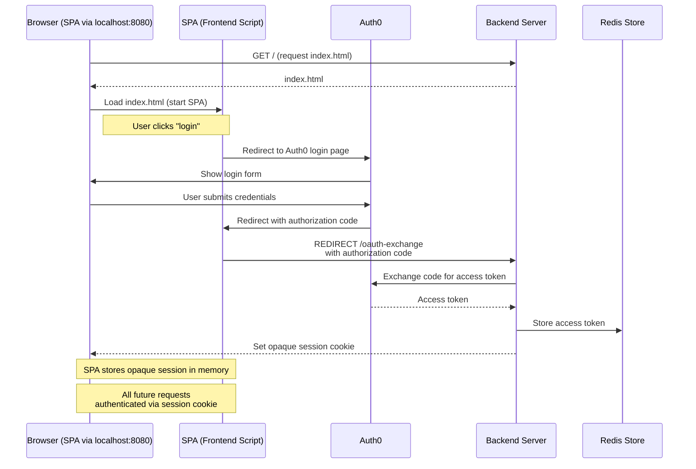

TL;DR:
1. run `docker compose up` in the root of the repo
2. run `go run ./spa-with-dynamic-backend` in the root of the repo
3. open `http://localhost:8080` in your browser
4. click "Start Login" button
  
This is an example of an SPA (Single Page Application) with a dynamic backend that uses oauth to facilitate the aquisition of access tokens from auth0. A sequence diagram illustrating the flow of authentication and token acquisition can be found below.

